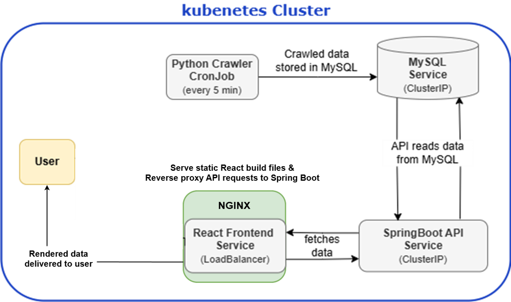
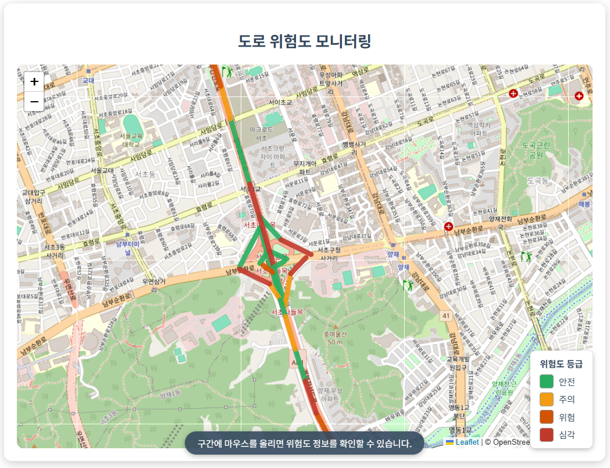
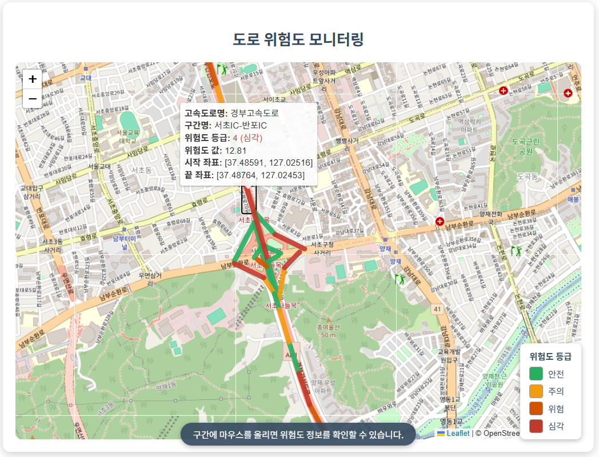
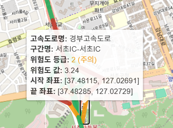
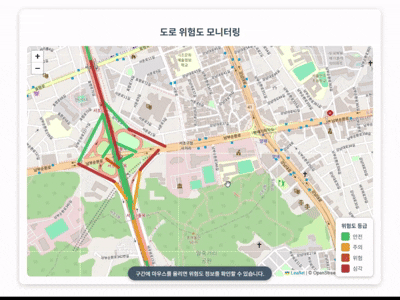

# 🖥️ Road Risk Monitor - Kubernetes Deployment

본 문서는 도로 위험도 모니터링 시스템의 Kubernetes 배포 구성에 대한 설명입니다.
경부고속도로 일부 구간의 위험도 정보를 5분마다 크롤링해 화면으로 보여줍니다. 

## 🛣️ 도로위험지수 (Road Risk Index)

도로위험지수는 도로 구간별 위험 등급(사고건수, 사상자수, 돌발, 소통, 기상정보, 시간대 반영)을 산출하여 **안전운전을 유도**할 수 있도록 제공되는 교통안전 정보입니다.

> **출처:** [도로위험지수 OpenAPI](https://www.data.go.kr/data/15057452/openapi.do)

---
## 시스템 구성도
<table>
<tr>
    <td align="center"><strong>시스템 구성도</strong></td>
  </tr>
  <tr>
    <td align="center"></td>
  </tr>
  </table>
## ✨ 배포 화면

<table>
  <tr>
    <td align="center"><strong>메인 화면</strong></td>
    <td align="center"><strong>도로 위험도 툴팁</strong></td>
  </tr>
  <tr>
    <td align="center"></td>
    <td align="center"></td>
  </tr>
  <tr>
    <td align="center"><strong>툴팁 상세 내용</strong></td>
    <td align="center"><strong>시연 화면</strong></td>
  </tr>
  <tr>
    <td align="center"></td>
    <td align="center"></td>
  </tr>
</table>

---

## 📁 디렉토리 구성
```
road-risk-monitor-k8s/
├── docker-build/ # Docker 빌드 관련 파일 
│ ├── python-collector/ # 파이썬 크롤러 
│ ├── react-frontend/ # React 프론트엔드
│ └── spring-boot-api/ # Spring Boot API
│
└── k8s/deploy # 매니페스트 파일 
│ ├── init.sql # MySQL DB 초기화 스크립트
│ ├── metallb-config.yaml # MetalLB LoadBalancer 설정
│ ├── mysql.yaml # MySQL StatefulSet 및 Service 정의
│ ├── python-collector-cronjob.yaml # 크롤링 코드를 5분마다 한번씩 실행시키는 CronJob
└ └── road-risk-monitor.yaml # Spring Boot API, React 프론트엔드 주요 리소스 정의
```
---
## 📌 배포 방법
```

kubectl apply -f k8s/deploy/metallb-config.yaml
kubectl apply -f k8s/deploy/mysql.yaml
kubectl apply -f k8s/deploy/road-risk-monitor.yaml
kubectl apply -f k8s/deploy/python-collector-cronjob.yaml

```
## 📝 실행 결과 예시 
1. kubectl get pods 상태
```
NAME                                      READY   STATUS      RESTARTS   AGE
mysql-xxxxxxx                             1/1     Running     0          10m
springboot-api-xxxxxx                     2/2     Running     0          8m
react-frontend-xxxxxx                     1/1     Running     0          8m
road-risk-collector-cron-xxxxxxxxxxx     0/1     Completed   0          5m
```
2. 브라우저 접속
```
kubectl get svc # ip 확인
http://[LoadBalancer IP]
```
3. 크론잡 로그 확인
```
kubectl logs job/road-risk-collector-cron-xxxxxxxx
```
- 크론잡 실행 시 데이터 수집 및 DB 저장 성공 로그 출력
- INFO 레벨로 크롤링 시작/종료, 저장 건수 등 기록

---

## 📄 각 매니페스트 파일 설명

### `init.sql`
- MySQL 데이터베이스 초기화 SQL 스크립트
- Python으로 크롤링한 데이터를 저장하는데 필요한 데이터베이스와 테이블을 생성하는 데 사용
- `mysql.yaml`에서 ConfigMap으로 참조되어 컨테이너 기동 시 실행
---
### `metallb-config.yaml`
- Kubernetes 클러스터에서 LoadBalancer 타입을 사용하기 위한 **MetalLB 설정**
- 클러스터 외부 브라우저에서 React 프론트엔드에 접속하기 위해 필요
---
### `mysql.yaml`
- MySQL 데이터베이스 배포
- 사용자 계정 및 초기 데이터베이스 생성 포함
- Persistent Volume을 사용한 데이터 영속화 예정
---
### `road-risk-monitor.yaml`
- 도로 위험도 모니터링 시스템을 위한 주요 컴포넌트(백엔드 API, 프론트엔드)의 Kubernetes 리소스를 한 번에 배포할 수 있는 통합 매니페스트
  - `springboot-api`: 도로 위험도 API 서비스
    - 가용성을 위해 2개의 Pod로 구성
    - 내부 통신용 ClusterIP 서비스 사용
  - `react-frontend`: React SPA 프론트엔드
    - 외부 브라우저에서 접근 가능하도록 LoadBalancer 타입의 서비스 사용
  - `ConfigMap`: nginx 설정 및 frontend 환경변수
  - `Service`: 클러스터 내 통신용 ClusterIP 서비스
---
### `python-collector-cronjob.yaml` 
- 5분마다 갱신되는 공공데이터 포털의 API에서 도로 위험도 데이터를 수집하여 DB에 저장하는 Python 수집기용 CronJob
  - 성공/실패 잡 히스토리 관리 설정으로 리소스 과다 사용 방지
  - 별도의 Deployment/Service 없이 주기 실행만을 위해 존재
---


